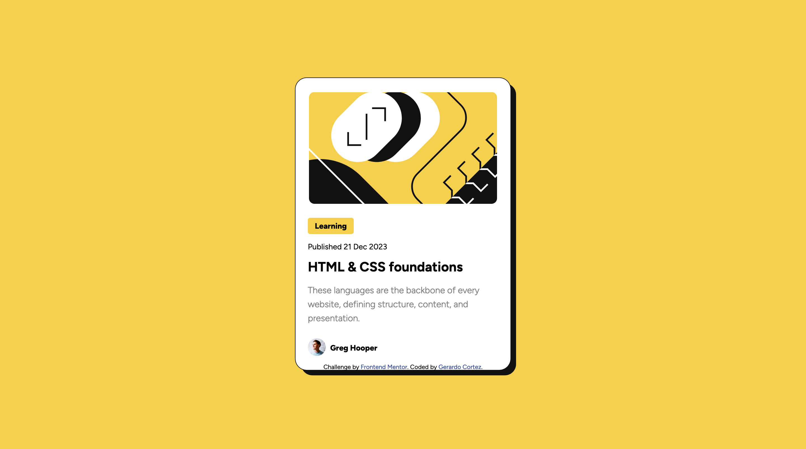

# Frontend Mentor - Blog preview card solution

This is a solution to the [Blog preview card challenge on Frontend Mentor](https://www.frontendmentor.io/challenges/blog-preview-card-ckPaj01IcS). Frontend Mentor challenges help you improve your coding skills by building realistic projects. 

## Table of contents

- [Overview](#overview)
  - [The challenge](#the-challenge)
  - [Screenshot](#screenshot)
  - [Links](#links)
- [My process](#my-process)
  - [Built with](#built-with)
  - [What I learned](#what-i-learned)
  - [Continued development](#continued-development)
- [Author](#author)

**Note: Delete this note and update the table of contents based on what sections you keep.**

## Overview

### The challenge

Users should be able to:

- See hover and focus states for all interactive elements on the page

### Screenshot




### Links

- Solution URL: [(https://github.com/BoiWonderr/blog-preview-card.git)]
- Live Site URL: [Add live site URL here](https://your-live-site-url.com)

## My process

### Built with

- Semantic HTML5 markup
- CSS custom properties
- CSS Grid
- Mobile-first workflow


### What I learned

I'm proud of this code even though it is pretty simple because I was struggling to get the border radius to work on the main image and it just wasn't working for whatever reason. I think it was because it is an SVG file (that's what I was under the impression..) so, I decided to make a div instead that would have the image has the background so I can bypass the issue. My plan worked out and I was proud of myself because I came up with a solution on my own after a testing so many different things.

```html
 <div class="img-wrapper">
        <div class="banner"></div>
  </div>
```
```css
.banner {
    background-image: url("assets/images/illustration-article.svg");  
    height: 12.5em;
    width: 17.438em;
    border-radius: 10px;
}
```
```js

```

### Continued development

With this project, I realized that there are major flaws in my ways of aligning content within a grid. I want to learn how I can do that to make it responsive. I also learned that you can do grids within grids and I want to practice that more.


## Author

- Website - [Gerardo Cortez](N/A)
- Frontend Mentor - [@BoiWonderr](https://www.frontendmentor.io/profile/BoiWonderr)
- Twitter - [@gcort_z2](https://x.com/gcort_z2)
- Instagram - [@g_cortez2](https://www.instagram.com/g_cortez2/)


